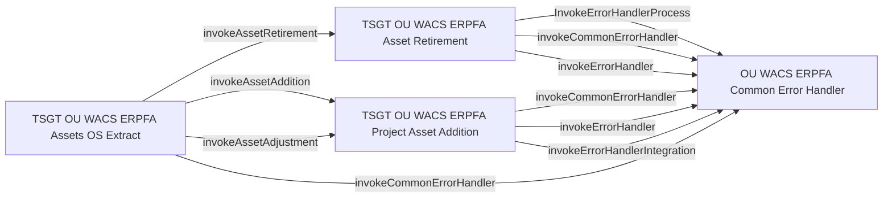

```mermaid
flowchart LR
%% Auto-generated from chain_group_004.csv
    TSGT_OU_WACS_ERPFA_ASSET_RETIRE["TSGT OU WACS ERPFA Asset Retirement"] -->|InvokeErrorHandlerProcess| OUTL_BA_WACS_ERPFA_ERROR["OU WACS ERPFA Common Error Handler"]
    TSGT_OU_WACS_ERPFA_ASSET_RETIRE["TSGT OU WACS ERPFA Asset Retirement"] -->|invokeCommonErrorHandler| OUTL_BA_WACS_ERPFA_ERROR["OU WACS ERPFA Common Error Handler"]
    TSGT_OU_WACS_ERPFA_ASSET_RETIRE["TSGT OU WACS ERPFA Asset Retirement"] -->|invokeErrorHandler| OUTL_BA_WACS_ERPFA_ERROR["OU WACS ERPFA Common Error Handler"]
    TSGT_OU_WACS_ERPFA_PRJ_ASSET_ADD["TSGT OU WACS ERPFA Project Asset Addition"] -->|invokeCommonErrorHandler| OUTL_BA_WACS_ERPFA_ERROR["OU WACS ERPFA Common Error Handler"]
    TSGT_OU_WACS_ERPFA_PRJ_ASSET_ADD["TSGT OU WACS ERPFA Project Asset Addition"] -->|invokeErrorHandler| OUTL_BA_WACS_ERPFA_ERROR["OU WACS ERPFA Common Error Handler"]
    TSGT_OU_WACS_ERPFA_PRJ_ASSET_ADD["TSGT OU WACS ERPFA Project Asset Addition"] -->|invokeErrorHandlerIntegration| OUTL_BA_WACS_ERPFA_ERROR["OU WACS ERPFA Common Error Handler"]
    TSGT_WACS_ERPFA_ASSET_OS_EXT["TSGT OU WACS ERPFA Assets OS Extract"] -->|invokeCommonErrorHandler| OUTL_BA_WACS_ERPFA_ERROR["OU WACS ERPFA Common Error Handler"]
    TSGT_WACS_ERPFA_ASSET_OS_EXT["TSGT OU WACS ERPFA Assets OS Extract"] -->|invokeAssetRetirement| TSGT_OU_WACS_ERPFA_ASSET_RETIRE["TSGT OU WACS ERPFA Asset Retirement"]
    TSGT_WACS_ERPFA_ASSET_OS_EXT["TSGT OU WACS ERPFA Assets OS Extract"] -->|invokeAssetAddition| TSGT_OU_WACS_ERPFA_PRJ_ASSET_ADD["TSGT OU WACS ERPFA Project Asset Addition"]
    TSGT_WACS_ERPFA_ASSET_OS_EXT["TSGT OU WACS ERPFA Assets OS Extract"] -->|invokeAssetAdjustment| TSGT_OU_WACS_ERPFA_PRJ_ASSET_ADD["TSGT OU WACS ERPFA Project Asset Addition"]
```