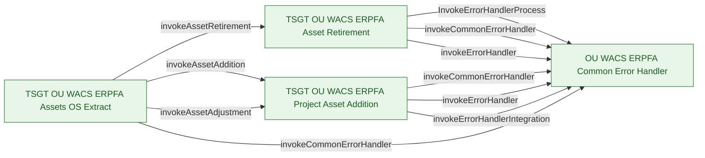

```mermaid
flowchart LR
%% Auto-generated from invoke_chain_group_004.csv
classDef integ fill:#e8f5e9,stroke:#2e7d32,color:#1b5e20;
classDef adapt fill:#e3f2fd,stroke:#1565c0,color:#0d47a1;
 TSGT_OU_WACS_ERPFA_ASSET_RETIRE["TSGT OU WACS ERPFA Asset Retirement"]:::integ
 OUTL_BA_WACS_ERPFA_ERROR["OU WACS ERPFA Common Error Handler"]:::integ
 TSGT_OU_WACS_ERPFA_ASSET_RETIRE -->|InvokeErrorHandlerProcess| OUTL_BA_WACS_ERPFA_ERROR
 TSGT_OU_WACS_ERPFA_ASSET_RETIRE -->|invokeCommonErrorHandler| OUTL_BA_WACS_ERPFA_ERROR
 TSGT_OU_WACS_ERPFA_ASSET_RETIRE -->|invokeErrorHandler| OUTL_BA_WACS_ERPFA_ERROR
 TSGT_OU_WACS_ERPFA_PRJ_ASSET_ADD["TSGT OU WACS ERPFA Project Asset Addition"]:::integ
 TSGT_OU_WACS_ERPFA_PRJ_ASSET_ADD -->|invokeCommonErrorHandler| OUTL_BA_WACS_ERPFA_ERROR
 TSGT_OU_WACS_ERPFA_PRJ_ASSET_ADD -->|invokeErrorHandler| OUTL_BA_WACS_ERPFA_ERROR
 TSGT_OU_WACS_ERPFA_PRJ_ASSET_ADD -->|invokeErrorHandlerIntegration| OUTL_BA_WACS_ERPFA_ERROR
 TSGT_WACS_ERPFA_ASSET_OS_EXT["TSGT OU WACS ERPFA Assets OS Extract"]:::integ
 TSGT_WACS_ERPFA_ASSET_OS_EXT -->|invokeCommonErrorHandler| OUTL_BA_WACS_ERPFA_ERROR
 TSGT_WACS_ERPFA_ASSET_OS_EXT -->|invokeAssetRetirement| TSGT_OU_WACS_ERPFA_ASSET_RETIRE
 TSGT_WACS_ERPFA_ASSET_OS_EXT -->|invokeAssetAddition| TSGT_OU_WACS_ERPFA_PRJ_ASSET_ADD
 TSGT_WACS_ERPFA_ASSET_OS_EXT -->|invokeAssetAdjustment| TSGT_OU_WACS_ERPFA_PRJ_ASSET_ADD
```