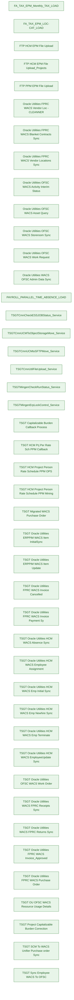

```mermaid
flowchart LR
%% Auto-generated from invoke_chain_group_005.csv
classDef integ fill:#e8f5e9,stroke:#2e7d32,color:#1b5e20;
classDef adapt fill:#e3f2fd,stroke:#1565c0,color:#0d47a1;
 FA_TAX_EPM_FTP["FA_TAX_EPM_Monthly_TAX_LOAD"]:::integ
 FA_TAX_EPM_LOC_CAT_LOAD["FA_TAX_EPM_LOC-CAT_LOAD"]:::integ
 FTP_HCM_EPM_FILE_UPLOAD["FTP HCM EPM File Upload"]:::integ
 FTP_HCM_EPM_FILE_UPLOA_PROJE["FTP HCM EPM File Upload_Projects"]:::integ
 FTP_PPM_EPM_FILE_UPLOAD["FTP PPM EPM File Upload"]:::integ
 ORAC_UTIL_FPRC_WACS_VEND_LOC__CL["Oracle Utilities FPRC WACS Vendor Loc -CLEANNER"]:::integ
 OUTL_BA_FPRC_WACS_BC_SYNC["Oracle Utilities FPRC WACS Blanket Contracts Sync"]:::integ
 OUTL_BA_FPRC_WACS_VEND_LOC_SYNC["Oracle Utilities FPRC WACS Vendor Locations Sync"]:::integ
 OUTL_BA_OFSC_WACS_ACTIVITY_STAT["Oracle Utilities OFSC WACS Activity Interim Status"]:::integ
 OUTL_BA_OFSC_WACS_ASSET_QUERY["Oracle Utilities OFSC WACS Asset Query"]:::integ
 OUTL_BA_OFSC_WACS_STOREROOM_SYNC["Oracle Utilities OFSC WACS Storeroom Sync"]:::integ
 OUTL_BA_OFSC_WACS_WORK_REQ["Oracle Utilities OFSC WACS Work Request"]:::integ
 OUTL_BA_WACS_OFSC_ADMIN_SYNC["Oracle Utilities WACS OFSC Admin Data Sync"]:::integ
 PAYROL_PARALL_TIME_ABSENC_LOAD["PAYROLL_PARALLEL_TIME_ABSENCE_LOAD"]:::integ
 TSGTCMNCHECKESSJOBSTATUS_SERVICE["TSGTCmnCheckESSJOBStatus_Service"]:::integ
 TSGTCMNUCMTOOBJEMOVE_SERVICE["TSGTCmnUCMToObjectStorageMove_Service"]:::integ
 TSGTCMNUCMTOSFTP_SERVICE["TSGTCmnUCMtoSFTPMove_Service"]:::integ
 TSGTCMNUTILFILEU_SERVICE["TSGTCmnUtilFileUpload_Service"]:::integ
 TSGTMINGENCHECKRUNSTATUS_SERVICE["TSGTMingenCheckRunStatus_Service"]:::integ
 TSGTMINGENERPLOCKCONTROL_SERVICE["TSGTMingenErpLockControl_Service"]:::integ
 TSGT_CAPITA_BURDEN_CALLBA_PROCES["TSGT Capitalizable Burden Callback Process"]:::integ
 TSGT_HCM_PRJ_PER_RATE_SCH_PPM_CA["TSGT HCM Prj Per Rate Sch PPM Callback"]:::integ
 TSGT_HCM_PROJ_PERS_RATE_SCHE_P_1["TSGT HCM Project Person Rate Schedule PPM OPS"]:::integ
 TSGT_HCM_PROJ_PERS_RATE_SCHE_P_2["TSGT HCM Project Person Rate Schedule PPM Mining"]:::integ
 TSGT_MIGRAT_WACS_PURCHA_ORDER["TSGT Migrated WACS Purchase Order"]:::integ
 TSGT_ORAC_UTIL_ERPP_WACS_ITEM_IN["TSGT Oracle Utilities ERPPIM WACS Item InitialSync"]:::integ
 TSGT_ORAC_UTIL_ERPP_WACS_ITEM_UP["TSGT Oracle Utilities ERPPIM WACS Item Update"]:::integ
 TSGT_ORAC_UTIL_FPRC_WACS_INVO_CA["TSGT Oracle Utilities FPRC WACS Invoice Cancelled"]:::integ
 TSGT_ORAC_UTIL_FPRC_WACS_INVO_PA["TSGT Oracle Utilities FPRC WACS Invoice Payment Sy"]:::integ
 TSGT_ORAC_UTIL_HCM_WACS_ABSE_SYN["TSGT Oracle Utilities HCM WACS Absence Sync"]:::integ
 TSGT_ORAC_UTIL_HCM_WACS_EMP_ASSG["TSGT Oracle Utilities HCM WACS Employee Assignment"]:::integ
 TSGT_ORAC_UTIL_HCM_WACS_EMP_INIT["TSGT Oracle Utilities HCM WACS Emp Initial Sync"]:::integ
 TSGT_ORAC_UTIL_HCM_WACS_EMP_NEWH["TSGT Oracle Utilities HCM WACS Emp Newhire Sync"]:::integ
 TSGT_ORAC_UTIL_HCM_WACS_EMP_TERM["TSGT Oracle Utilities HCM WACS Emp Terminate"]:::integ
 TSGT_ORAC_UTIL_HCM_WACS_EMP_UPD["TSGT Oracle Utilities HCM WACS EmployeeUpdate Sync"]:::integ
 TSGT_ORAC_UTIL_OFSC_WACS_WORK_OR["TSGT Oracle Utilities OFSC WACS Work Order"]:::integ
 TSGT_ORAC_UTIL_WACS_FPRC_RECE_SY["TSGT Oracle Utilities WACS FPRC Receipts Sync"]:::integ
 TSGT_ORAC_UTIL_WACS_FPRC_RETU_SY["TSGT Oracle Utilities WACS FPRC Returns Sync"]:::integ
 TSGT_OUTIL_FPRC_WACS_INVOICE_APP["TSGT Oracle Utilities FPRC WACS Invoice_Approved"]:::integ
 TSGT_OUTL_FPRC_WACS_PO_SYNC["TSGT Oracle Utilities FPRC WACS Purchase Order"]:::integ
 TSGT_OU_OFSC_WACS_RESO_USAG_DETA["TSGT OU OFSC WACS Resource Usage Details"]:::integ
 TSGT_PROJEC_CAPITA_BURDEN_CORREC["TSGT Project Capitalizable Burden Correction"]:::integ
 TSGT_SCM_TO_WACS_UNIFER_PO_SYNC["TSGT SCM To WACS Unifier Purchase order Sync"]:::integ
 TSGT_SYNC_EMPLO_WACS_TO_OFSC["TSGT Sync Employee WACS To OFSC"]:::integ
```